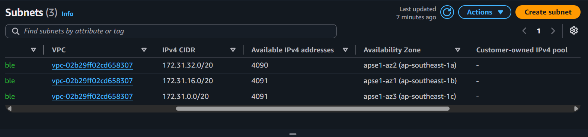
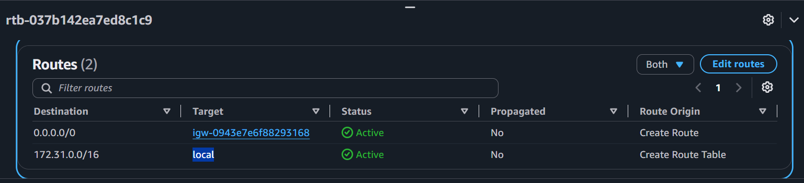
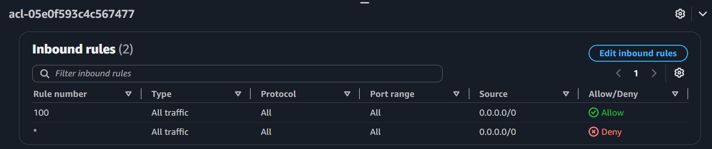
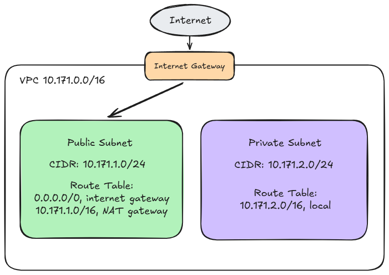

# Assignment 2 Submission

<!--
How to use this template:

1. Copy this file to submissions/assignment-2/<your-github-username>/submission.md
2. Replace every answer placeholder with your own answer. Delete the angle brackets too.
3. Save your four images in the same folder, with the exact file names below.
4. Do not write your full name or your student number in this file.
-->

## About me

- GitHub username: DeviDo2
- Section: IV-CCSAD
- IAM user name that I signed in with: ccsad-g05
- X: 171

---

## Part A. Explore

### A1. The VPC

Default VPC IPv4 CIDR:

172.31.0.0/16

Number of addresses in that CIDR:

65,536

### A2. The subnets

| Availability Zone | IPv4 CIDR |
| --- | --- |
| ap-southeast-1a | 172.31.32.0/20 |
| ap-southeast-1b | 172.31.16.0/20 |
| ap-southeast-1c | 172.31.0.0/20 |

Screenshot 1. Save it as `screenshot-1-subnets.png` in your folder. The image line below shows it.

### A3. Available addresses

Available IPv4 addresses in each subnet:

ap-southeast-1a, 4090, ap-southeast-1b, 4091, ap-southeast-1c, 4091

Why is the number lower than 4,096?

The number is lower than the expected number because each subnet has five addresses stored by AWS: the first four and the final one so they are not usable by instances.

What uses the missing address in the subnet with the lowest number?

The missing addresses are reserved for network communication

### A4. The route table

| Destination | Target |
| --- | --- |
| 0.0.0.0/0 | igw-0943e7e6f88293168 |
| 172.31.0.0/16 | local |

Screenshot 2. Save it as `screenshot-2-routes.png` in your folder. The image line below shows it.

### A5. Public or private

Are the default subnets public or private? Which route proves it?

Public. The destination 0.0.0.0/0 points to an internet gateway which is igw-0943e7e6f88293168

### A6. The internet gateway

State of the internet gateway:

Attached

What happens to the default subnets if the gateway is detached?

If it is detached, the subnet won't be able to reach the internet and vice versa.

### A7. NAT gateways

Number of NAT gateways:

0

Can a server in a new private subnet download updates? Why?

No, because a private subnet does not have a route to an internet gateway or a public address assigned to its resources.

### A8. The network ACL

| Rule number | Source | Allow or Deny |
| --- | --- | --- |
| 100 | 0.0.0.0/0 | Allow |
| * | 0.0.0.0/0 | Deny |

How is a network ACL different from a security group?

A network ACL operates at the subnet level as a stateless firewall that requires explicit rules for both inbound and outbound traffic, supporting both allow and deny rules. In contrast, a security group operates at the instance level as a stateful firewall that automatically permits return traffic for allowed connections and supports allow rules only.

Screenshot 3. Save it as `screenshot-3-network-acl.png` in your folder. The image line below shows it.

### A9. The default security group

Inbound rule (type and source):

All traffic, sg-0c5b6d4081cf0a534

Which resources can send traffic to an instance that uses it?

Only the resources in the security group named default can send traffic to it.

---

## Part B. Prepare

### B1. Plan two subnets

- Public subnet CIDR: 10.171.1.0/24
- Private subnet CIDR: 10.171.2.0/24

### B2. Route tables

Route table of the public subnet:

| Destination | Target |
| --- | --- |
| 0.0.0.0/0 | internet gateway |
| 10.171.1.0/16 | NAT gateway |

Route table of the private subnet:

| Destination | Target |
| --- | --- |
| 10.171.2.0/16 | local |

### B3. My VPC diagram

Tool used (Excalidraw, draw.io, Lucidchart, or paper):

Excalidraw

Save your diagram as `vpc-diagram.png` in your folder. The image line below shows it.

### B4. Predict a change

Can you still open the web page from your laptop? Why?

No, because the route 0.0.0.0/0 represents the entire IPv4 internet. Deleting this route removes the gateway's ability to forward external traffic in and out, making the instance unreachable from the internet

Can the instance still reach another instance in the VPC? Why?

Yes, since communication within a VPC relies on the local route, which is automatically created and hard-bound into the route table.

### B5. Place a database

Which subnet gets the database? Why?

The private subnet, because a database contains sensitive information and should never be directly accessible from the public internet.

### B6. My question about VPCs

What is your question, and what made you think of it?

I can't think of one
